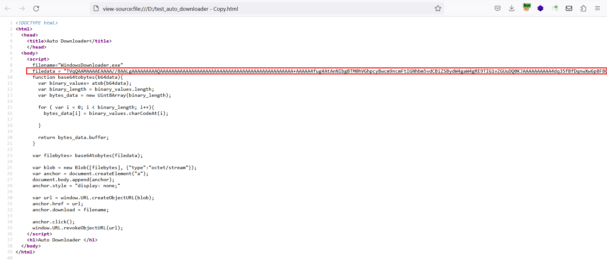
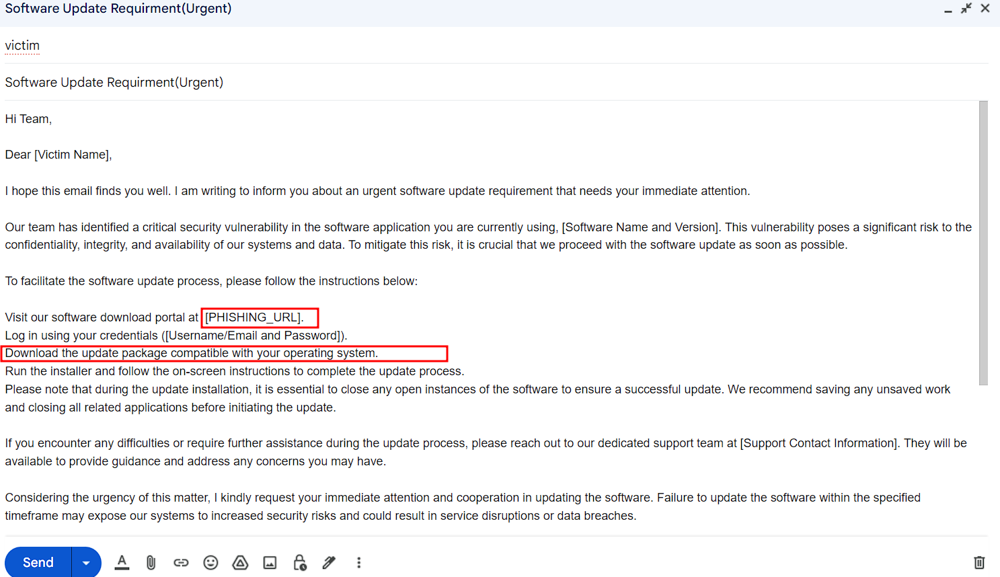

# Malware Delivery - Software Update using Auto downloader

Malware delivery through software updates is a sophisticated technique that takes advantage of users' trust in legitimate software update mechanisms. Here's the whole process :-

## PROCESS
  
**Step 1:**     Create a malware and attach it to any trusted application(exe) accroding to victim.

**Step 2:**     Convert the application into base 64 using below command
**Command:**    $base64string = [Convert]::ToBase64String([IO.File]::ReadAllBytes($FileName))
**Command:**    [IO.File]::WriteAllBytes($FileName, [Convert]::FromBase64String($base64string))

**Step 3:**     Change the value of filedata  in Autodownloader Script  

**Step 4:**     We can also use evilgnix to make the phishing more interacting if needed

**Step 5:**     Send the email containg link of our autodownloader page as SOFTWARE DOWNLOAD LINK.

Find both email template and autodownloader code in repository.

# Malware Delivery - Macros DOCS

Malware delivery through DOCS is a another technique that takes advantage of users' trust in legitimate DOCX from company that  forces user to enable MACRO which allows attacker to execute powershell code via Macros. Here's the whole process :-

## PROCESS
  
**Step 1:**     Create a legitimate docx files showing in image and share in repository.

**Step 4:**     We can also use evilgnix to make the phishing more interacting if needed

**Step 5:**     Send the email containg link of our docx page as PDF DOWNLOAD LINK.

Find both docx template and email template code in repository.
